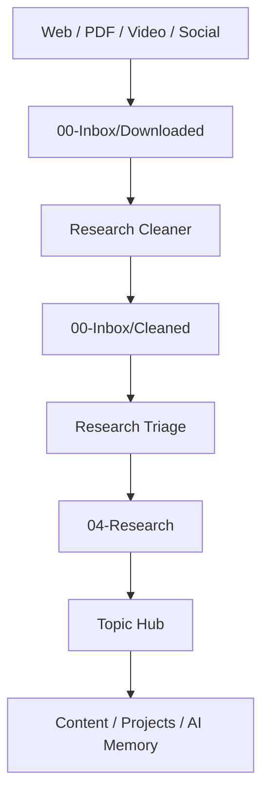

# Research Collection Workflow

```mermaid
flowchart TD
    A["Web / PDF / Video / Social"] --> B["00-Inbox/Downloaded"]
    B --> C["Research Cleaner"]
    C --> D["00-Inbox/Cleaned"]
    D --> E["Research Triage"]
    E --> F["04-Research"]
    F --> G["Topic Hub"]
    G --> H["Content / Projects / AI Memory"]
```

## 日常流程

1. 所有资料先收集，不急着分类。
2. 每天或每周批量运行 Research Cleaner。
3. 对 Cleaned 中的资料做人工快速分拣。
4. 有长期价值的经验、决策和工作流同步写入 `97-AI-Memory` 或 `98-AI-Context`。

