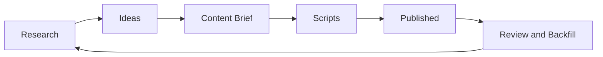

# Content Production Workflow

```mermaid
flowchart LR
    A["Research"] --> B["Ideas"]
    B --> C["Content Brief"]
    C --> D["Scripts"]
    D --> E["Published"]
    E --> F["Review and Backfill"]
    F --> A
```

## 内容状态

- `Ideas`：选题、角度、标题池
- `Scripts`：脚本、口播稿、视频拆稿
- `Published`：已发布内容、链接、数据回填

## 输出平台

- 公众号
- YouTube
- B站
- 小红书
- 抖音
- TikTok
- 课程

