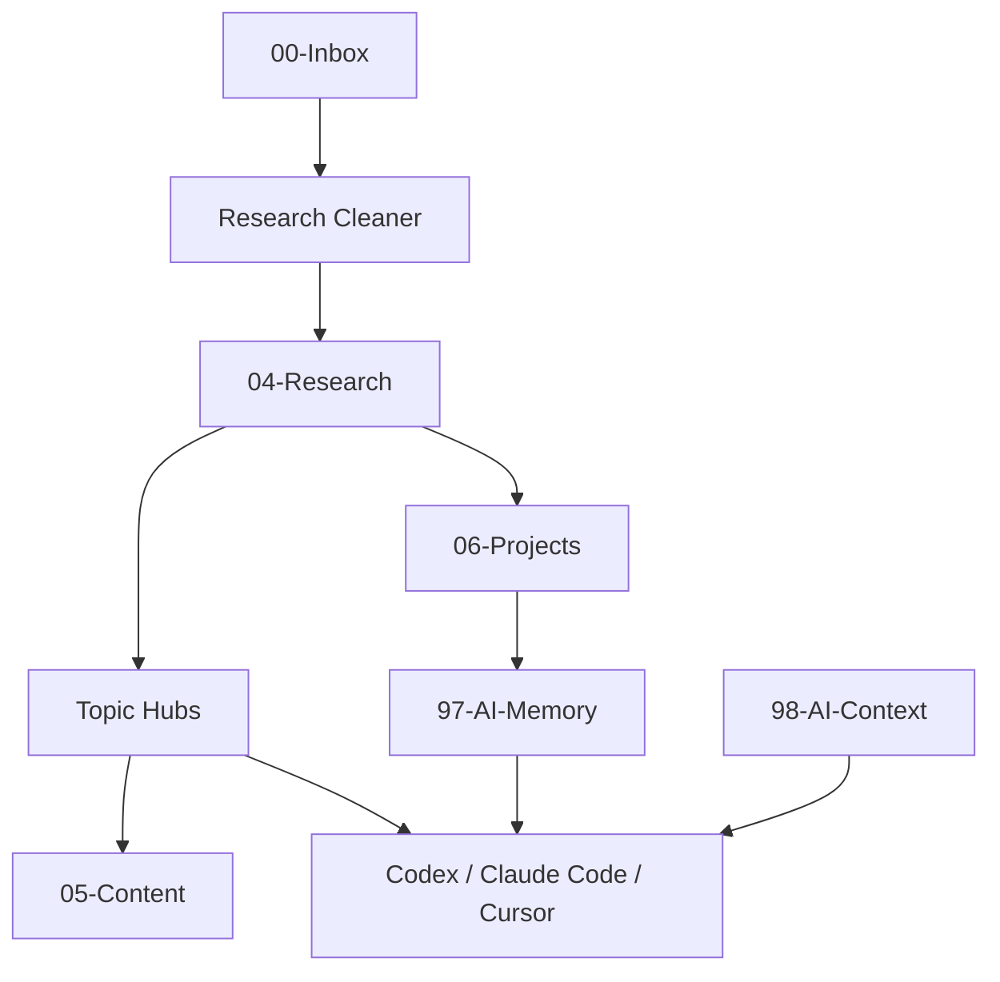

# Knowledge Map

```mermaid
flowchart TD
    Inbox["00-Inbox"] --> Cleaner["Research Cleaner"]
    Cleaner --> Research["04-Research"]
    Research --> Topics["Topic Hubs"]
    Topics --> Content["05-Content"]
    Research --> Projects["06-Projects"]
    Projects --> Memory["97-AI-Memory"]
    Context["98-AI-Context"] --> Agents["Codex / Claude Code / Cursor"]
    Memory --> Agents
    Topics --> Agents
```

## 当前知识地图

- AI Agent 工作流
- Prompt 与自动化
- MCP 与工具调用
- Obsidian 知识管理
- GitHub 同步
- 内容创作与平台分发
- GEO 与 AI 引用

