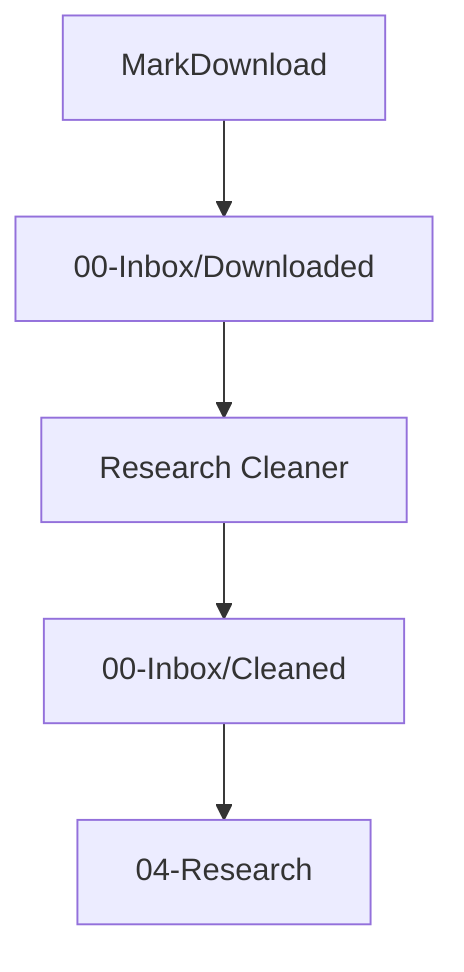

# MarkDownload Workflow

```mermaid
flowchart TD
    A["MarkDownload"] --> B["00-Inbox/Downloaded"]
    B --> C["Research Cleaner"]
    C --> D["00-Inbox/Cleaned"]
    D --> E["04-Research"]
```

## MarkDownload 保存规则

- 默认保存目录：`00-Inbox/Downloaded`
- 文件名：`{date} - {pageTitle}.md`
- 保留原始 URL
- 保留作者和发布时间
- 正文不总结、不删减

